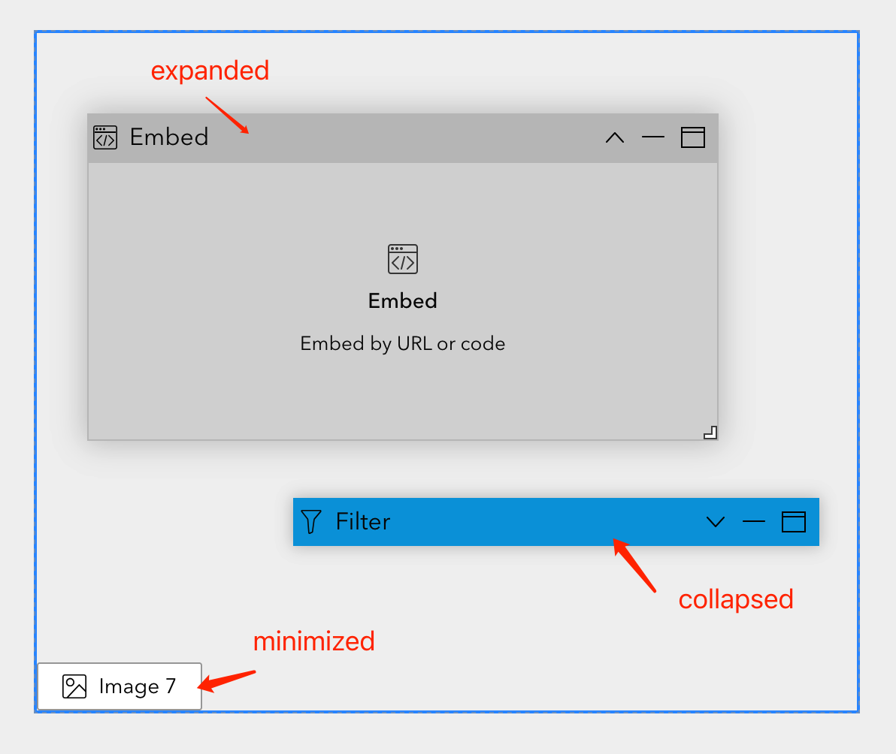

# Dock
This is a layout widget for Experience Builder. It allows users to create flexible layouts by adding, removing, and rearranging items.

## Structure of the source code
- src
  -runtime
    - assets
      - icon.svg
    - widget.tsx
    - builder-support.tsx
    - layout
      - builder
        - layout.tsx
        - layout-item.tsx
        - panel-item.tsx
      - runtime
        - layout.tsx
        - layout-item.tsx
        - panel-item.tsx
      - common
        - panel.tsx
        - item-title.tsx

## Layout widget



The layout widget supports both runtime and builder modes, providing a consistent experience for users. The layout is a container that can hold multiple items. Layout items has similar UI/UX and has its own position and size within the layout.

The layout builder includes extra features such as drag-and-drop functionality, item resizing. It should implement the `DropHandlers` interface to handle drag-and-drop events.

```typescript
  // prepare the layout for accepting items
  handleDragEnter: (draggingItem: LayoutItemConstructorProps) => void
  // clear the layout when the item is dragged out
  handleDragLeave: (draggingItem: LayoutItemConstructorProps) => void
  // highlight the drop target when an item is dragged over it
  handleDragOver: (
    draggingItem: LayoutItemConstructorProps,
    draggingElement: HTMLElement,
    containerRect: DOMRect,
    itemRect: DOMRect & { handlerRect?: DOMRect },
    clientX: number,
    clientY: number,
    speed?: number
  ) => void
  // update the app config when an item is dropped
  handleDrop: (
    draggingItem: LayoutItemConstructorProps,
    containerRect: DOMRect,
    itemRect: DOMRect & { handlerRect?: DOMRect },
  ) => void
```

## Make the layout item interactive
You can design the UI/UX of the layout item as you like. In this example, the layout item has a header and a content area. The header contains the item icon, label and some action buttons, including minimize, expand/collapse and maximize. The header is draggable, allowing users to rearrange items within the layout. You can also resize the item by dragging the resize handle at the bottom right corner of the item.

To make the layout item interactive, you can use the `bindResizeHandler` and `bindDragHandler` functions from the `jimu-layouts/layout-builder` package. These functions will bind the necessary event handlers to the layout item, allowing it to be dragged and resized at runtime.

> code from /layout/common/panel.tsx

```
import { bindResizeHandler, bindDragHandler } from 'jimu-layouts/layout-builder'

interactable = interact(elementRef.current).origin('parent')
bindDragHandler(interactable, {
  layoutId,
  layoutItemId,
  onDragging: window.jimuConfig.isInBuilder ? null : handleDragging,
  onDragEnd: handleDragEnd,
  useDragHandler: true,
  draggableAtRuntime: true,
  itemType: null,
  rootLayoutId: () => '',
  restrict: () => true
})
bindResizeHandler(interactable, {
  layoutItemId,
  restrictEdges: true,
  onResizeStart: handleResizeStart,
  onResizing: handleResizing,
  onResizeEnd: handleResizeEnd
})
```
